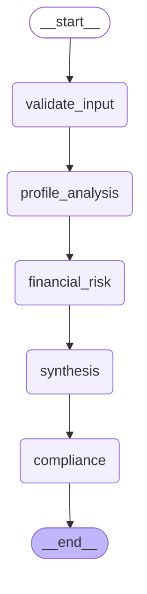

# LangGraph DAG Visualization

```mermaid
---
config:
  flowchart:
    curve: linear
---
graph TD;
	__start__([<p>__start__</p>]):::first
	validate_input(validate_input)
	profile_analysis(profile_analysis)
	financial_risk(financial_risk)
	synthesis(synthesis)
	compliance(compliance)
	__end__([<p>__end__</p>]):::last
	__start__ --> validate_input;
	financial_risk --> synthesis;
	profile_analysis --> financial_risk;
	synthesis --> compliance;
	validate_input --> profile_analysis;
	compliance --> __end__;
	classDef default fill:#f2f0ff,line-height:1.2
	classDef first fill-opacity:0
	classDef last fill:#bfb6fc

```

## How to view:
1. Visit https://mermaid.live
2. Paste the diagram above
3. Or use VS Code Mermaid extension
